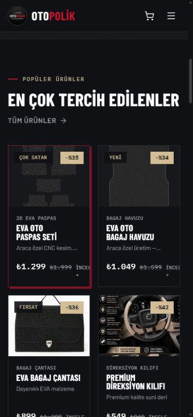
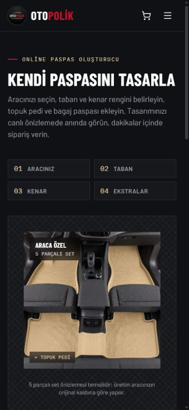
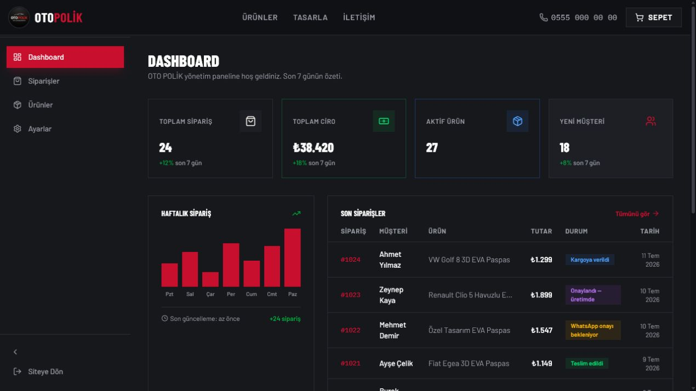

# OTO POLİK — Kapsamlı Tarayıcı UI/UX Denetimi

**Tarih:** 12 Temmuz 2026  
**Ortam:** Yerel Next.js geliştirme sunucusu  
**Görünümler:** 1440×900 masaüstü, 768×1024 tablet, 390×844 mobil  
**Yöntem:** Sayfalar görünür tarayıcıda açıldı, kaydırıldı; menü, arama, ürün, renk, sepet, form, boş durum ve admin akışları etkileşimli test edildi.

> **Uygulama güncellemesi — 12 Temmuz 2026:** P1 mobil tasarlayıcı, canlı önizleme, WhatsApp çakışması, admin/store chrome ayrımı, admin mobil drawer, mobil ürün kartları, ürün detay satın alma çubuğu, sepet/ödeme hydration, form erişilebilirliği ve metadata düzeltmeleri uygulandı. Gerçek işletme bilgileri ile kartlı ödeme sağlayıcısı entegrasyonu, doğrulanmış veri/sağlayıcı bilgisi gerektirdiği için açık kalmıştır. Teknik doğrulama ayrıntıları `docs/ui-design/audit-fixes/design-spec.md` içindedir.

## Yönetici özeti

Mağazanın görsel kimliği güçlü ve ayırt edici. Antrasit zemin, kırmızı vurgu, kum rengi teknik detaylar ve Barlow Condensed başlıklar oto aksesuarı/atölye karakterini iyi taşıyor. Temel katalog → ürün → sepet → sipariş talebi akışı çalışıyor.

Canlıya çıkmadan önce çözülmesi gereken en önemli konular mobil tasarlayıcının seçenekleri örten sticky özeti, çalışmayan canlı renk önizlemesi, her sayfada içerik kapatan WhatsApp düğmesi ve mobil admin panelinin kırık olmasıdır.

### Genel puan

| Kategori | Puan | Kısa değerlendirme |
|---|---:|---|
| Marka ve renk sistemi | 8/10 | Güçlü, tutarlı ve sektöre uygun |
| Tipografi | 8/10 | Karakterli; küçük teknik metinlerde yoğunluk artıyor |
| Masaüstü mağaza düzeni | 7/10 | Güçlü hero ve net akış; bazı bölümlerde fazla boşluk |
| Mobil mağaza düzeni | 5/10 | Temel responsive yapı var; sabit katman çakışmaları ciddi |
| Ürün keşfi | 6/10 | Filtreler çalışıyor; mobil kartlar fazla dar |
| Tasarlayıcı UX | 3/10 | Form mantığı iyi, fakat mobil örtüşme ve canlı önizleme hatalı |
| Sepet ve sipariş | 6/10 | Akış çalışıyor; doğrulama ve ödeme güveni eksik |
| Erişilebilirlik | 6/10 | Kontrast/focus iyi; bazı ikon düğmeleri isimsiz |
| Admin masaüstü | 6/10 | Görsel olarak düzenli; önemli işlemler işlevsiz |
| Admin mobil | 2/10 | İçerik görünümü kullanılamaz durumda |

## Ekran görüntüleri

### Mobil ürün kartları

### Mobil tasarlayıcı

### Admin masaüstü

## Kritik ve yüksek öncelikli bulgular

### P1 — Mobil tasarlayıcı özeti seçeneklerin üstünü kapatıyor

Mobilde sipariş özeti `position: sticky`, `z-index: 20` ve yaklaşık **399 px** yüksekliğinde. Sayfa kaydırıldığında taban/kenar renkleri ile ekstra seçeneklerin üzerinde duruyor. Kullanıcı alttaki kontrolleri görse bile özet kartıyla yarışıyor.

**Düzeltme:** Mobilde büyük sticky kartı kaldırın. Yerine 64–72 px yüksekliğinde sabit alt bar kullanın: `Toplam fiyat + Sepete Ekle`. Ayrıntılı özet normal belge akışında kalsın. Sticky kart yalnızca `lg` ve üzeri ekranda kullanılabilir.

### P1 — Canlı renk önizlemesi çalışmıyor

Tasarlayıcı “Siyah taban · Kırmızı kenar” seçili gösterirken önizlemede bej kaynak fotoğraf görünüyor. Canvas 1 saniye sonra da `invisible` kalıyor; kullanıcı renk seçiminin ürüne yansımasını göremiyor. Hata sessizce yutulduğu için kullanıcıya fallback açıklaması da sunulmuyor.

**Düzeltme:** Canvas hazırlama hatasını görünür şekilde yönetin. Önizleme hazır olana kadar skeleton gösterin; hata halinde “Renk önizlemesi yüklenemedi” mesajı verin. Renk değişiminden sonra canvas görünürlüğü ve piksel çıktısı otomatik test edilmelidir.

### P1 — Sabit WhatsApp düğmesi içerikleri kapatıyor

390 px mobil görünümde düğme şu alanların üzerine geliyor:

- Ana sayfa araç bulucu formu
- Katalogdaki ilk ürün kartları
- Tasarlayıcı önizleme açıklaması ve sticky özet
- Sipariş formundaki “Ödeme Şekli” alanı
- İletişim kartındaki e-posta
- Footer adresi ve 404 sayfası footer’ı

**Düzeltme:** Mobilde düğmeyi 48 px’e düşürün, güvenli alt/sağ boşluk kullanın ve form/checkout/admin sayfalarında gizleyin. Sayfa altına yaklaşınca footer üzerinde kalmaması için sticky CTA alanıyla koordineli davranmalıdır.

### P1 — Mobil admin paneli kullanılamıyor

Mobilde mağaza header’ı, admin sidebar, sepet ve WhatsApp katmanları birlikte render ediliyor. Admin içerik kartları sağ tarafa sıkışıyor; dashboard değerleri okunamıyor. Admin ana layout’u mağazanın global layout katmanlarından ayrılmamış.

**Düzeltme:** Admin için route group veya ayrı root layout kullanın. Mağaza Header/Footer/CartDrawer/WhatsappFloat admin rotalarında render edilmemeli. Sidebar mobilde drawer olmalı; içerik `w-full`, tek kolon ve yatay taşmasız çalışmalı.

### P1 — Admin alanı doğrudan erişilebilir

`/admin`, `/admin/siparisler`, `/admin/urunler` ve `/admin/ayarlar` giriş doğrulaması olmadan açılıyor. Bu yalnızca UX değil, canlı ortam için güvenlik problemidir.

**Düzeltme:** Sunucu taraflı kimlik doğrulama ve rol kontrolü ekleyin; sadece `noindex` yeterli değildir.

### P1 — Admin işlemleri tamamlanmamış

- Sipariş listesi testte sürekli “Siparişler yükleniyor...” durumunda kaldı.
- “Yeni Ürün Ekle” tıklandığında görünür form/modal açılmadı.
- Ürün kartlarındaki düzenle/sil kontrollerinin işlem akışı yok.
- Ayarlar formu görsel olarak mevcut; ancak alanlar `name`/validasyon sözleşmesine sahip değil.

**Düzeltme:** Admini yayın navigasyonundan önce gerçek loading, success, empty ve error durumlarıyla tamamlayın. İşlevsiz kontrolleri gizlemek yerine geliştirme etiketiyle ayırın.

## Mağaza UI/UX bulguları

### Renk sistemi — başarılı

Kullanılan temel kontrastlar WCAG AA seviyesini karşılıyor:

| Kombinasyon | Kontrast |
|---|---:|
| Açık metin / koyu zemin | 16.42:1 |
| Muted metin / koyu zemin | 6.97:1 |
| Kum rengi / koyu zemin | 10.33:1 |
| Beyaz / marka kırmızısı | 5.88:1 |
| Kırmızı UI çizgisi / koyu zemin | 3.21:1 |

Kırmızı ana CTA, indirim etiketi, aktif filtre, admin seçimi ve dekoratif çizgilerde aynı anda kullanıldığında vurgu hiyerarşisi zayıflıyor. Kırmızıyı bir ekranda tek ana eyleme saklamak daha iyi olur.

### Tipografi — güçlü ama küçük metinler yoğun

Barlow Condensed + Barlow + IBM Plex Mono kombinasyonu markaya özel bir “teknik kesim föyü” hissi veriyor. Büyük başlıklar başarılı. Buna karşılık 10–11 px mono etiketler, mobil kartlardaki fiyat/eski fiyat/“İncele” satırı ve uzun büyük harf başlıklar küçük ekranda yorucu.

**Öneri:** Mobil teknik etiketleri minimum 11–12 px yapın; kart fiyat satırında eski fiyatı ikinci satıra taşıyın veya “İncele” yazısını kaldırın.

### Ana sayfa hero — güçlü

Hero ilk izlenimi iyi veriyor: ürün faydası net, başlık güçlü, ana ve ikincil CTA ayrışıyor. Tablet ve mobil kırılımlarda başlık okunaklı. Ancak hero otomobil atmosferini satıyor; gerçek EVA ürününü ilk ekranda ikinci plana atıyor.

**Öneri:** Hero içinde küçük bir gerçek ürün detayı veya “5 parçalı set” mikro görseli ekleyin. Ana CTA kırmızı, ikincil CTA çerçeveli kalabilir.

### Ana sayfa ürün konumu — doğru, kart yoğunluğu sorunlu

Popüler ürünler hero/duyuru bandından hemen sonra geliyor; konum doğru. Mobilde iki kolon nedeniyle kart genişliği yaklaşık 166 px. Fiyat + eski fiyat + “İncele” aynı satırda sıkışıp kesiliyor. Görseller de farklı çekim dili kullanıyor: koyu paspas, beyaz fonda çanta ve metinli direksiyon reklamı yan yana.

**Düzeltme:** 390 px altında tek kolon veya yatay kaydırmalı 1.25 kart kullanın. Alternatif olarak kart alt satırını iki satıra bölün. Ürün fotoğraflarını aynı arka plan, ışık, kadraj ve 4:3 oranla yeniden hazırlayın.

### Bölüm ritmi

Masaüstünde bazı bölümler arasında büyük boşluklar var. Bu premium hissi destekliyor; fakat ürün gridinden atölye galerisine geçişte gereğinden fazla kopukluk oluşuyor.

**Öneri:** Büyük bölüm aralıklarını yaklaşık %20 azaltın. Aynı içerik türleri arasında sabit bir spacing sistemi kullanın.

### Atölye galerisi

Galeri güven oluşturuyor; ancak bir karede kauçuk/havuzlu yüzey, diğerlerinde EVA paspas görülmesi ürün vaadini karıştırıyor.

**Öneri:** Galeriyi “EVA doku / kalıp / kenar / araç içi sonuç” şeklinde dört net kanıta dönüştürün.

## Katalog

### Başarılı noktalar

- Arama, kategori, marka, yıl ve sıralama aynı blokta toplanmış.
- “Egea” araması doğru şekilde tek Fiat Egea sonucuna indi.
- Boş sonuç durumunda filtre temizleme ve WhatsApp kurtarma akışı var.
- Mobilde yatay sayfa taşması yok.

### İyileştirmeler

- Mobilde dört kontrol ve kategori/marka chip’leri ürünlerden önce fazla dikey alan kaplıyor.
- “Tüm Kategoriler” ve “Tüm Markalar” aktif durumları iki farklı görsel dil kullanıyor.
- WhatsApp düğmesi ilk ürünleri örtüyor.
- Boş “Bagaj Paspası” kategorisi aktif ürün varmış gibi sunuluyor.

**Öneri:** Mobilde “Filtrele ve Sırala” bottom-sheet kullanın; yalnızca arama alanını açık bırakın. Aktif filtreleri tek chip sisteminde gösterin.

## Ürün detay sayfası

- Mobil ana görsel 366×366 px ile iyi boyutta.
- Thumbnail’lar 60×60 px; dokunma için yeterli.
- Ancak “Sepete Ekle” CTA’sı mobilde yaklaşık **1787 px** aşağıda kalıyor.
- Araç uyumluluğu, kargo ve set içeriği CTA’dan önce uzun bir blok oluşturuyor.
- Adet azalt/artır düğmelerinin erişilebilir adı yok.
- Ürün detayında yaklaşık 4 px yatay taşma ölçüldü.
- İlgili ürün görselleri ve isim/kategori dili daha tutarlı hale getirilmeli.

**Düzeltme:** Mobilde alt sabit satın alma barı kullanın. Uyumluluk/kargo/set içeriğini kısa rozet + akordeon yapısına alın. Adet düğmelerine “Adedi azalt/artır” etiketi ekleyin.

## Sepet ve sipariş

### Başarılı

- Seçilen gri ürün sepette doğru renk ile göründü.
- Üç ürünün toplamı ve ücretsiz kargo doğru hesaplandı.
- Masaüstü sepet drawer’ı 448 px genişlikte ve dengeli.
- Zorunlu alanlar boşken tarayıcı doğrulaması çalışıyor.

### Sorunlar

- Dolu sepet sayfasında hydration tamamlanmadan kısa süre “Sepetiniz boş” görünüyor.
- Sipariş formu alanlarında `name`, `autocomplete` ve telefon `pattern` değerleri yok.
- Hatalar sadece tarayıcının varsayılan balonuyla gösteriliyor; inline hata/özet yok.
- Kredi kartı seçeneği devre dışı “yakında” mesajı olarak duruyor.
- Mobil WhatsApp düğmesi ödeme yöntemi alanını kapatıyor.

## Erişilebilirlik

### Başarılı

- Global `:focus-visible` halkası tanımlı.
- `prefers-reduced-motion` desteği mevcut.
- Ana renk kontrastları AA seviyesinde.
- Tasarlayıcı renk düğmelerinin erişilebilir renk adları var.

### Eksikler

- Mobil sepet ikonunun adı ürün sayısıyla birleşiyor; net “Sepetim, 3 ürün” etiketi yok.
- Ürün detay adet düğmeleri isimsiz.
- Admin ürün kartı düzenle/sil düğmeleri yalnız hover’da görünür; touch cihazında erişilemez.
- Formlar inline hata açıklaması ve `aria-describedby` kullanmıyor.
- 36×36 px header ikonları önerilen 44×44 px mobil dokunma hedefinin altında.

## SEO ve içerik tutarlılığı

- Hakkımızda ve İletişim başlıkları `| OTO POLİK | OTO POLİK` şeklinde markayı iki kez ekliyor.
- Ürün detayında da aynı çift marka eki görüldü.
- Ödeme, teşekkür ve 404 ekranları genel ana sayfa title’ını kullanıyor.
- Telefon, WhatsApp, e-posta, adres ve Instagram bilgileri placeholder.
- Admin panelindeki kategori özeti aksesuar ürünlerini “3D EVA” olarak etiketleyebiliyor.

## Önerilen uygulama sırası

1. Mobil tasarlayıcı sticky özetini küçültün ve canlı renk önizlemesini düzeltin.
2. WhatsApp düğmesinin sayfa/breakpoint davranışını yeniden tasarlayın.
3. Admini ayrı layout + kimlik doğrulama ile ayırın; mobil layout ve işlevsiz işlemleri tamamlayın.
4. Mobil ürün kartlarını ve ürün detay satın alma CTA’sını yeniden düzenleyin.
5. Sipariş formu otomatik doldurma, inline doğrulama ve ödeme durumunu tamamlayın.
6. Metadata tekrarlarını ve gerçek işletme bilgilerini düzeltin.
7. Ürün fotoğraf standardını ve bölüm spacing sistemini birleştirin.

## Sonuç

Tasarım dili atılmamalı; mevcut “premium teknik atölye” yönü korunmalı. Sorun estetik temel değil, özellikle mobilde sabit/sticky katmanların birbirinden habersiz davranması ve tamamlanmamış etkileşimlerdir. İlk üç öncelik çözüldüğünde mağaza görsel olarak güçlü ve satışa daha hazır hale gelir.
